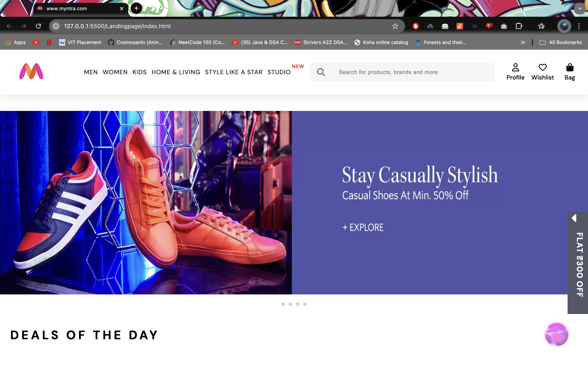
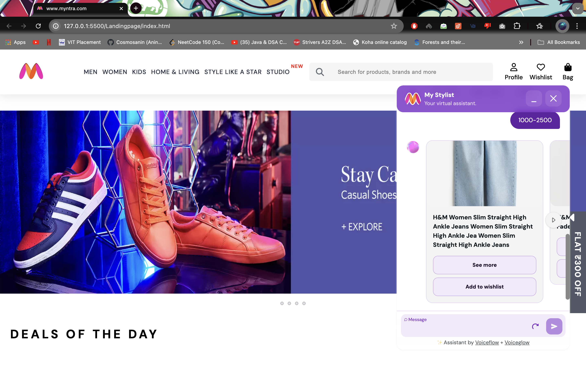

Team XCV Submission
## Index
- **[About](#about)**
- **[Features](#features)**
- **[Instructions for running locally](#Instructions-for-running-locally)**
- **[Screenshots](#screenshots)**
- **[Tech Stack](#tech-stack)**   
- **[File Structure](#file-structure)**
## About
Myntra's "My Stylist" feature leverages advanced AI 
technology to provide personalized fashion
recommendations based on user-uploaded images. The AI-
powered chatbot analyzes the user's outfit and suggests
tailored matching products from Myntra's extensive catalog,
empowering users to find the perfect complementary items
for a cohesive look.

The "Style Like a Star" interface allows users
to explore the latest fashion trends and looks
sported by popular celebrities on Myntra.
Users can seamlessly discover the same outfits
worn by their favorite stars by simply clicking
the "Discover the Collection" button. This
feature not only provides inspiration for users
to emulate the style of their idols but also
enables them to effortlessly shop the curated
collections.

## Features
- Users get personalized, occasion-based recommendations influenced by social media trends and real-life
inspirations, creating a cohesive and engaging shopping experience that blends personalization with social
interaction.
- Al assistant "My Stylist" would the first technology to be introduced in any online shopping platform
which would respond to the queries of the customer and suggest the outfits.
- Time- Efficient :Saves the time spent on choosing the piece of cloth from lakhs of options to a concised amount.
- Helpful for Gen-Z audience who are patient to search and want fast-fashion.

# Instructions for running locally

## Initial steps

If you already have Visual Code Studio installed, download the zip file from the code dropdown menu and open
the folder on VS code and run the index.html file on live server:

## Screenshots

## Tech Stack Used
-Frontend -HTML,CSS
-Backend -Javascript
-Chatbot- 
1.Frontend:

React: A JavaScript library for building user interfaces.
Redux: A state management library for JavaScript apps.
TypeScript: A superset of JavaScript that adds static typing.

2.Backend:

Node.js: A JavaScript runtime built on Chrome's V8 JavaScript engine.
Express: A web application framework for Node.js.
GraphQL: A query language for APIs and a runtime for executing those queries.

3.Database:

MongoDB: A NoSQL database for storing data in JSON-like documents.
PostgreSQL: A relational database system.

4.Cloud Services:

AWS (Amazon Web Services): For various cloud services including hosting, storage, and computing.
Firebase: For real-time database and authentication services.
Authentication:

OAuth 2.0: For secure authentication.
JWT (JSON Web Tokens): For securely transmitting information between parties.

5.APIs and Integrations:

Voice APIs: Integration with voice assistant platforms like Amazon Alexa and Google Assistant.
Chat APIs: Integration with chat platforms like Facebook Messenger and Slack.

6.DevOps and CI/CD:

Docker: For containerizing applications.
Kubernetes: For container orchestration.
Jenkins: For continuous integration and continuous deployment (CI/CD).

7.Analytics and Monitoring:

Google Analytics: For tracking user interactions and behavior.
Datadog: For monitoring and performance tracking.

8.Collaboration and Project Management:

Jira: For issue and project tracking.
Confluence: For documentation and collaboration.

### Server

- [FastAPI](https://fastapi.tiangolo.com/#example)
- [Pytorch](https://pytorch.org/)
- [NLTK](https://www.nltk.org/)
### Web App

- [React.js](https://reactjs.org/docs/getting-started.html)
- [Jeeliz](https://github.com/jeeliz/jeelizGlassesVTOWidget)
### Others
